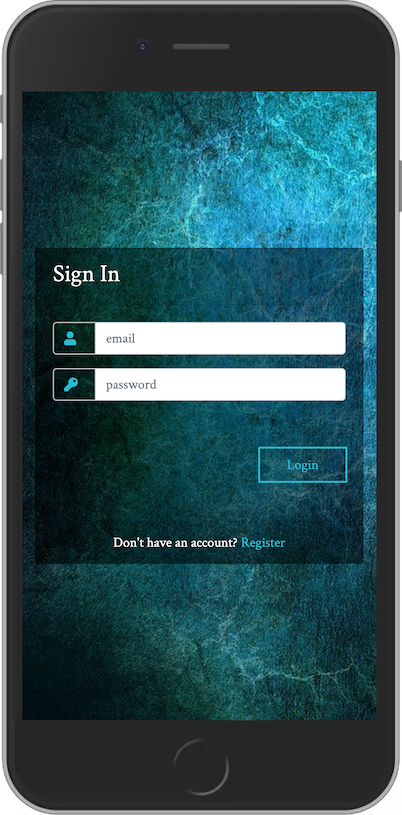
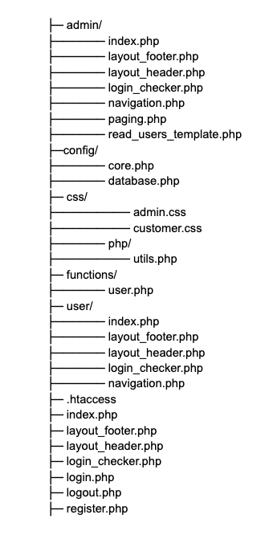

# login
PHP Login Script Using Sessions 

 :height: 100px
   :width: 200 px
   :scale: 50 %

Features

  - User and admin login with sessions.
  - Register new system users.
  - View system users from admin page.
 
  


### File Structure



Admin Login
```sh
Username: janed@example.com
Password: janed123
```
User Login
```sh
Username: jd@example.com
Password: johnd123
```

License
----

MIT
